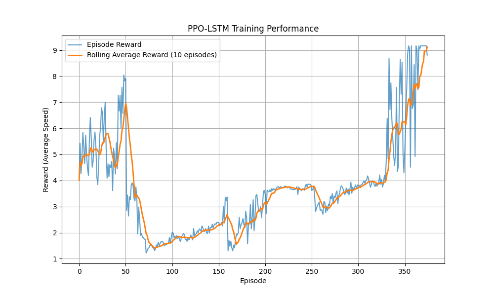

# Introduction and Flow of the Project

This project focuses on optimizing traffic light control in an urban traffic network using **Proximal Policy Optimization (PPO)** with a **Long Short-Term Memory (LSTM)** network. The goal is to **reduce congestion** by dynamically adjusting traffic light phases based on real-time traffic conditions.

The project follows a **reinforcement learning (RL)** approach where an agent learns to optimize traffic signals by interacting with a **SUMO (Simulation of Urban Mobility)** environment. The **PPO-LSTM agent** selects actions based on historical traffic data and receives rewards based on the **average speed of vehicles** in the network.

## Workflow of the Project

### **Traffic Simulation Environment (SumoGymEnv)**
- Simulates traffic movements using SUMO.
- Provides lane-specific traffic data.
- Uses a reinforcement learning interface with discrete traffic signal actions.

### **Policy Learning (PPO_LSTM_Agent)**
- Uses an LSTM-based actor-critic network to model traffic dynamics over time.
- Implements **PPO with clipping and KL divergence monitoring**.
- Updates policy iteratively to improve traffic flow.

### **Training and Evaluation**
- Trains the agent over multiple episodes.
- Uses **average vehicle speed** as the reward metric.
- Implements **early stopping criteria** when performance stabilizes.

---

# Aims of the Project

✅ **Reduce Traffic Congestion**: Learn optimal traffic light policies to improve vehicle flow.  
✅ **Use Historical Data Efficiently**: Implement LSTM to capture temporal dependencies in traffic patterns.  
✅ **Ensure Stable Policy Updates**: Use PPO with KL divergence and gradient clipping for stable learning.  
✅ **Enable Real-World Applicability**: Provide a framework that could be extended to real-world traffic light control systems.  

---

# Results and Performance

The primary performance metric is the **average speed of vehicles** across episodes. We track:

- **Episode reward** (average vehicle speed per step)
- **Rolling average reward** (smoothed over recent episodes)
- **Number of simulation steps** needed to complete an episode

## Key Observations
- Initially, the **reward increases**, indicating improved traffic flow.
- After a certain number of episodes, **performance stabilizes** or even deteriorates due to policy exploration.
- **Early stopping** ensures we stop training once a satisfactory traffic flow is achieved.

---

# Visualization of Rolling Average Reward**
- Helps smooth fluctuations in performance.
- Indicates when the model stabilizes.

---

# Problems Faced and Solutions

### **1. NaN values in logits during training**
- **Problem**: Logits became NaN, crashing the training process.  
- **Solution**:
  - Gradient Clipping to prevent exploding gradients.
  - Advantage Normalization to ensure stable policy updates.
  - Logging Tensor Values before passing to categorical distributions.

### **2. SUMO Simulation Errors (None State)**
- **Problem**: The simulation returned `None`, breaking the RL loop.  
- **Solution**:
  - Randomly fill missing states for debugging.
  - Check SUMO connectivity before running simulation.

### **3. Training Instability**
- **Problem**: Policy performance degraded after initial improvement.  
- **Solution**:
  - Implemented KL divergence monitoring to control large updates.
  - Reduced learning rate to improve convergence stability.

### **4. Long Training Time**
- **Problem**: Training required too many episodes before convergence.  
- **Solution**:
  - Introduced early stopping when rewards reached a satisfactory threshold.

---

# Future Improvements

🔹 **Hybrid RL Approach**: Combine PPO with rule-based heuristics to improve stability.  
🔹 **Continuous Action Space**: Instead of discrete traffic phases, experiment with continuous timing adjustments.  
🔹 **Multi-Agent RL**: Train multiple RL agents for different intersections for coordinated traffic control.  
🔹 **Reward Function Refinement**: Incorporate queue length penalties along with vehicle speed.  
🔹 **Real-World Deployment**: Extend to real-world traffic datasets and deploy in actual smart city infrastructure.  

---

# Broader Applications

The techniques used in this project could be applied to:

- **🚦 Smart City Traffic Management**: Automating real-time signal control in urban areas.
- **🚗 Autonomous Vehicle Coordination**: Managing self-driving vehicle interactions with traffic lights.
- **📦 Supply Chain and Logistics**: Optimizing delivery truck routes based on dynamic road conditions.

---

# Conclusion

This project successfully demonstrates the use of **reinforcement learning (PPO-LSTM) for traffic light optimization**. Through SUMO simulation and PPO training, the model effectively learns policies to improve traffic flow, with key improvements in **average vehicle speed and congestion reduction**.

Future work will focus on **multi-agent coordination and real-world deployment** to maximize impact.
